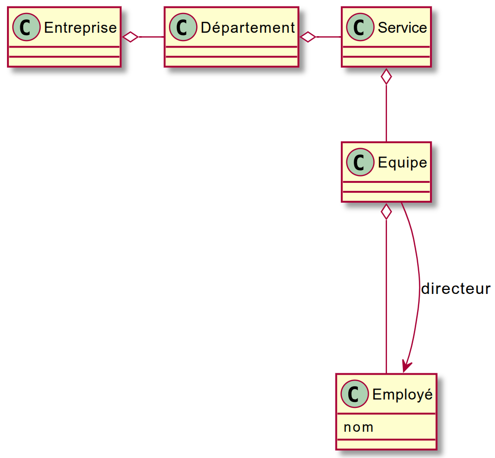
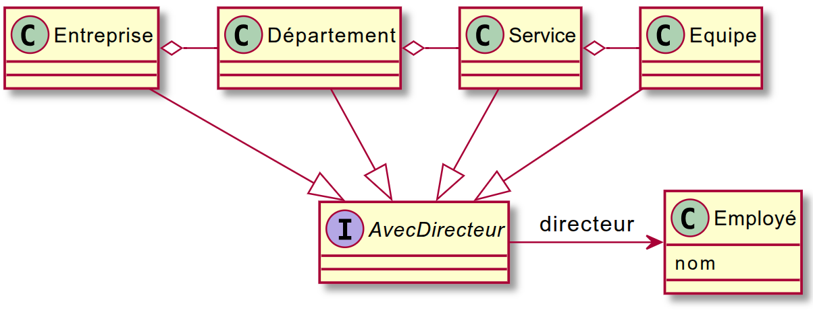

# TP 03 : Rappels de conception objet

[⬇️ Télécharger le TP (tp03.zip)](tp03.zip)

!!! note "Objectif du TP"
    
    L’objectif de ce TP est de consolider vos connaissances en **programmation orientée objet** :  
    - réduction du **couplage** entre classes,  
    - respect de la **loi de Déméter**,  
    - et mise en pratique de principes de **bonne conception logicielle** (interfaces, dépendances inversées, réutilisabilité).

!!! note Instructions préliminaires

    Avant de commencer ce TP, vous devez :

    1. Créer un **nouveau dépôt GitHub** nommé `tp03-conception-objet`.  
    2. Ajouter le compte **[@rezakaziz](https://github.com/rezakaziz)** comme **collaborateur** du projet.  
    - Allez dans `Settings` → `Collaborators` → `Add people` → recherchez `rezakaziz`.
    3. Clonez votre dépôt en local et travaillez dessus pour les exercices suivants.  
    4. Commitez et poussez régulièrement vos modifications (`git add .`, `git commit -m "progression"`, `git push`).

---

## Exercice 1 : Suppression du couplage
!!! Question "Question 1 — Réduire le couplage avec un logger"

    Un logiciel de calcul enregistre (ou *logge*) ses étapes pour permettre une vérification ultérieure.  
    L’implémentation actuelle se trouve dans le package `exo1q1v1`.

    Cependant, la classe `FileLogger` utilisée rend les tests unitaires difficiles à écrire et à maintenir.

    💭 **Analyse du problème**

    - Les exceptions lancées par le logger sont-elles bien gérées dans le code actuel ?  
    - Pourquoi cette approche rend-elle le logiciel moins flexible ?

    💡 **Travail demandé**

    1. Dans le package `exo1q1v2`, créez une **interface** pour réduire le couplage.
    2. Fournissez **trois implémentations** :
        - `NullLogger` : ne fait rien (utile pour désactiver les logs)  
        - `MemoryLogger` : stocke les messages dans une `ArrayList<String>` (utile pour les tests)  
        - `FileLogger` : reprend le comportement initial (écriture dans un fichier)
    3. Modifiez le code du calcul pour qu’il dépende de l’**interface** et non plus d’une classe concrète.
    4. **Réfléchissez** : qui doit instancier le logger et pourquoi ?  
       

---

!!! Question "Question 2 — Exportation flexible du catalogue"

    On dispose d’une classe `Catalogue` représentant un ensemble de produits.  
    Dans le package `exo1q2v1`, cette classe peut exporter son contenu au format **XML** via une classe `XMLDumper`.

    Cependant, le couplage entre `Catalogue` et `XMLDumper` est **trop fort** :  
    la classe `Catalogue` ne devrait pas dépendre d’un format spécifique.

    💭 **Problème à résoudre**

    - Pourquoi le fait que `Catalogue` appelle directement `XMLDumper` pose-t-il problème ?  
    - Comment rendre cette architecture extensible pour d’autres formats (JSON, YAML, etc.) ?

    💡 **Travail demandé**

    1. Concevez une **abstraction** qui sépare la logique métier (`Catalogue`) du format d’exportation.  
    2. Implémentez au moins deux exporteurs :
        - `XMLDumper` : exporte en XML (implémentation existante adaptée à la nouvelle interface)
        - `JSONDumper` : exporte en JSON
    3. (Optionnel, si vous avez le temps) : ajoutez un `YAMLExporter`  
       → Pensez à gérer la profondeur d’écriture avec une variable d’instance.
    4. Testez votre architecture en vérifiant qu’un changement de format ne nécessite **aucune modification** du code de `Catalogue`.

    📘 Exemple attendu pour le JSON (indentation facultative) :

    ```json
    {"@type":"catalogue", 
        "contenu":[
            {"@type":"produit",
                 "contenu":[
                        {"@type":"designation", "contenu":["texte":"souris"]},
                        {"@type":"prix", "contenu":["texte":"30.0"]}
                        ]
            },
            {"@type":"produit",
                 "contenu":[
                        {"@type":"designation", "contenu":["texte":"ordi"]},
                        {"@type":"prix", "contenu":["texte":"600.0"]}
                        ]
            }
        ]
    }
    ```


---
## Exercice 2 : Loi de Déméter

!!! Question "Question 1 — Comprendre et appliquer la loi de Déméter"

    On dispose de l’architecture suivante représentant une entreprise :
    
    { width="50%" }

    ??? note "PlantUML"
        ```puml
        @startuml
        skin rose
        class Employé {
            nom
        }
        Entreprise o- Département
        Département o- Service
        Service o-- Equipe
        Equipe o--- Employé
        Equipe --> Employé : directeur
        @enduml
        ```
    

    Une méthode du programme vise à retourner la liste des **noms des directeurs d’équipe**.

    💭 **Questions de réflexion**

    - Cette méthode respecte-t-elle la **loi de Déméter** ? 
    - Quels sont les symptômes d’une violation de cette loi dans le code actuel ?
    - Que se passerait-il si la hiérarchie de classes changeait (ajout d’un niveau, renommage, etc.) ?

    💡 **Travail demandé**

    - Refactorez la méthode de manière à respecter la loi de Déméter.  
    - Testez que la méthode fonctionne toujours après la modification.

---

!!! Question "Question 2 — Généraliser la notion de direction"

    On découvre ensuite que **toutes les entités** (Entreprise, Département, Service, Équipe) peuvent avoir un **directeur**.

    Le modèle devient alors :

    { width="50%" }

    ??? note "PlantUML"
        ```puml
        @startuml
        skin rose
        Interface AvecDirecteur
        AvecDirecteur -> Employé : directeur
        class Employé {
            nom
        }
        Entreprise o- Département
        Département o- Service
        Service o- Equipe

        Entreprise --|> AvecDirecteur
        Département --|> AvecDirecteur
        Service --|> AvecDirecteur
        Equipe --|> AvecDirecteur
        @enduml
        ```

    

    💭 **Réflexion**

    - Comment adapter votre solution précédente pour qu’elle fonctionne avec cette nouvelle hiérarchie ?  
    - Votre code reste-t-il conforme à la **loi de Déméter** ?
    - Faut-il introduire une abstraction (interface, méthode commune, ou visiteur) pour traiter toutes ces entités de manière uniforme ?

    💡 **Travail demandé**

    - Refactorez votre code pour intégrer la notion d’`AvecDirecteur`.
    


---


## Exercice 3 : SOLID et refactorisation

!!! Question "Question 1 — Identifier les violations des principes SOLID"

    💭 **Travail d’analyse**

    - Parcourez votre code des exercices précédents.  
    - Pour chaque principe SOLID (**SRP, OCP, LSP, ISP, DIP**), identifiez :
        - un endroit où le principe est **respecté** ;
        - un endroit où il est **violé** (même légèrement).  
    - Justifiez vos réponses.

    💡 **Extension possible**

    - Proposez des **refactorisation** pour corriger les violation identifiée.  


---
!!! info "Remarque"

    Pour créer un site web avec le rapport de test, utilisez la commande Maven suivante :
    
    ```bash
    mvn surefire-report:report
    ```
